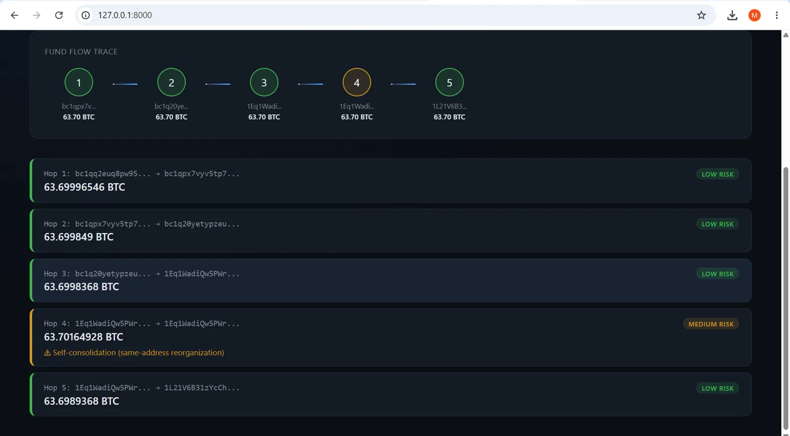

# Ransomware Payment Tracer

A blockchain forensics tool that reconstructs how ransomware payments move across the Bitcoin network, applied to the real, publicly documented 2021 Colonial Pipeline / DarkSide ransomware case. Built to demonstrate the intersection of cybersecurity investigation, financial crime analysis, and blockchain data.

**Live case reconstructed:** the 63.7 BTC portion of the Colonial Pipeline ransom, corroborating the trail documented in the [DOJ's public seizure affidavit](https://www.justice.gov/opa/pr/department-justice-seizes-23-million-cryptocurrency-paid-ransomware-extortionists-darkside).

---

## What it does

1. **Traces funds hop by hop** from any starting Bitcoin address, using **UTXO-level matching** — each hop is verified to actually spend the specific coins received in the previous hop, rather than assuming an address's largest outgoing transaction is the correct path forward. This avoids false positives caused by address reuse.
2. **Detects self-consolidation patterns** — distinguishes a wallet reorganizing its own coins (not a real transfer) from genuine fund movement to a new party.
3. **Screens every hop against a real sanctions list** — built from the U.S. Treasury's live OFAC SDN sanctions data (~240 validated Bitcoin addresses), plus rule-based flags for suspicious value drops.
4. **Renders the trace live** in an interactive dashboard — paste in any Bitcoin address and get a real-time, visual fund-flow reconstruction.

## Demo


*Live trace of the Colonial Pipeline / DarkSide ransom payment, showing the full 5-hop fund-flow reconstruction.*

The tracer also correctly distinguishes genuine fund movement from same-address wallet consolidation — a common blockchain pattern that a naive tracer would misread as a real transfer:


*Hop 4 correctly flagged as "Self-consolidation" rather than a real transfer to a new party — see [METHODOLOGY.md](METHODOLOGY.md) for how this was identified and fixed.*

Try it yourself with the Colonial Pipeline seed address:
```
bc1qq2euq8pw950klpjcawuy4uj39ym43hs6cfsegq
```

## Architecture

```
fetch_transactions.py   → core tracing engine (pulls live blockchain data, walks hops)
detect_risk.py          → risk scoring (blacklist matching, anomaly rules)
build_blacklist.py      → builds blacklist.json from the official OFAC SDN sanctions list
app.py                  → FastAPI backend serving trace + risk data
dashboard.html          → live, interactive frontend
```

Data flow: `fetch_transactions.py` → `trace_output.json` → `detect_risk.py` → `risk_report.json` → served by `app.py` → rendered in `dashboard.html`

## Running it locally

```bash
git clone https://github.com/secworkspace/ransomware-payment-tracer.git
cd ransomware-payment-tracer
python -m venv venv
venv\Scripts\activate        # or source venv/bin/activate on Mac/Linux
pip install -r requirements.txt
uvicorn app:app --reload
```
Then open `http://127.0.0.1:8000` in your browser.

To rebuild the sanctions blacklist yourself with the latest OFAC data:
```bash
# Download the current SDN list from:
# https://sanctionslistservice.ofac.treas.gov/api/PublicationPreview/exports/SDN.CSV
# Save it as sdn_list.csv in this folder, then run:
python build_blacklist.py
```

## Key technical decisions

See [METHODOLOGY.md](METHODOLOGY.md) for a detailed writeup of the UTXO-matching approach, the self-consolidation debugging process, and the OFAC data pipeline.

## Limitations & future work

This is a proof-of-concept demonstrating core forensic tracing methodology — not a production compliance tool. Known limitations:
- Follows the single largest-value path per hop; does not yet visualize full fan-out/branching transaction graphs
- Bitcoin only; no support for Ethereum or other chains yet
- Does not handle cross-chain bridges, privacy coins, or heavily obfuscated mixer outputs
- Blacklist is a point-in-time snapshot; real deployments would refresh it on a schedule

Planned additions: full transaction graph visualization, address clustering heuristics, multi-chain support (Ethereum), and a lightweight ML anomaly-detection layer alongside the current rule-based engine.

## Tech stack

Python, FastAPI, REST APIs, Bitcoin/UTXO blockchain data, U.S. Treasury OFAC sanctions data

## Disclaimer

Built for educational and portfolio purposes. Not affiliated with any law enforcement or blockchain forensics company. All data used is publicly available.
